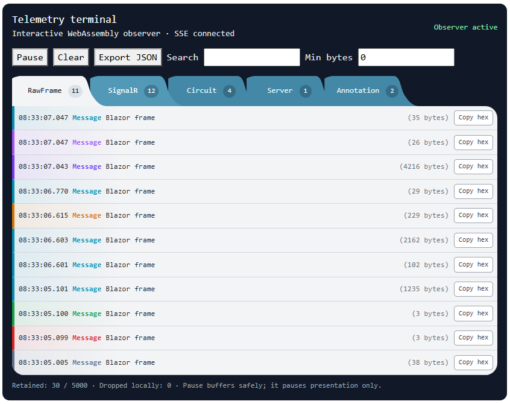

# Blazor Circuit Telemetry — educational POC

This repository is an **proof of concept**, not a production telemetry product. It is a hands-on way to learn what happens inside an Interactive Server Blazor circuit: browser events, the SignalR WebSocket, server-side work, render batches, JavaScript interop, and circuit lifecycle transitions.

The POC deliberately keeps the observed circuit separate from its display. That separation is the central lesson: the terminal must not create extra traffic or a feedback loop on the circuit it is explaining.



*The Interactive WebAssembly terminal lets learners inspect captured frames, decoded messages, circuit events, server events, and POC annotations without modifying the Interactive Server circuit being observed.*

## Run it

1. Run the `BlazorCircuitTelemetry` project with the `Development` environment.
2. Open `/` (the POC page).
3. Use the Interactive Server playground while watching the WebAssembly telemetry terminal.

Telemetry is enabled by default only in `appsettings.Development.json`:

```json
{
  "BlazorTelemetry": { "Enabled": true }
}
```

The server event endpoint is intentionally unavailable outside Development or when this setting is `false`.

## What it teaches

The page contains two sibling interactive islands hosted by static SSR:

| Island | Render mode | Role |
| --- | --- | --- |
| Interactive Server playground | `InteractiveServer` | The circuit being studied. Try its counter, input bindings, render-size experiment, timer, JavaScript interop, async operation, handled error, and navigation. |
| Telemetry terminal | `InteractiveWebAssembly` | A local observer that displays events without rendering through, or sending telemetry back over, the observed Server circuit. |

The terminal combines three deliberately distinct kinds of evidence:

- **Observed:** a browser-side wrapper records WebSocket activity for `/_blazor`, including raw frames and connection events.
- **Decoded/framework:** the observer parses SignalR MessagePack framing and recognizes supported message types and selected Blazor targets such as `JS.RenderBatch`, `OnRenderCompleted`, and `JS.EndInvokeDotNet`; the server's `CircuitHandler` reports circuit lifecycle events.
- **Instrumented:** the playground adds application annotations and operation timing; a dedicated SSE endpoint streams server events to the terminal.

Use the tabs, search, byte filter, pause, clear, and browser-only JSON export to explore the resulting timeline. The built-in “How the telemetry is decoded” reference documents the framing and links to the relevant ASP.NET Core source.

## Experiments worth trying

- Compare `change` binding with `oninput` binding to see how event frequency affects traffic and renders.
- Increase the generated rows, then inspect the `JS.RenderBatch` entries and render byte sizes.
- Start the server timer to observe periodic server-driven renders.
- Trigger the JavaScript interop and async-handler samples to follow their request/completion messages and annotations.
- In browser DevTools, briefly enable Offline mode. Compare **connection down** with **circuit closed**: losing a SignalR connection does not by itself mean the circuit has been disposed. Reload to create a new circuit.

## Important boundaries and limitations

- This is for learning and local development. It captures traffic and payload previews that can contain user data; do not expose it publicly or treat it as a security-monitoring solution.
- Captured entries are bounded in memory. Exports stay in the browser and telemetry is not persisted server-side by default.
- SSE is intentionally separate from the Blazor SignalR connection. Each terminal has its own bounded subscription so a slow observer does not block the observed circuit.
- The decoder is a small educational implementation, not a general-purpose or compatibility-guaranteed Blazor protocol decoder. Blazor circuit messages and internal targets are implementation details that can change with .NET releases.
- Message classification and timing-based correlation are aids to understanding, not proof of every causal relationship. A WebSocket reopening, for example, is not automatically a confirmed circuit reconnection.

For the full intended scope and acceptance criteria, see `Blazor_Circuit_Telemetry_POC_Prompt.txt`.
